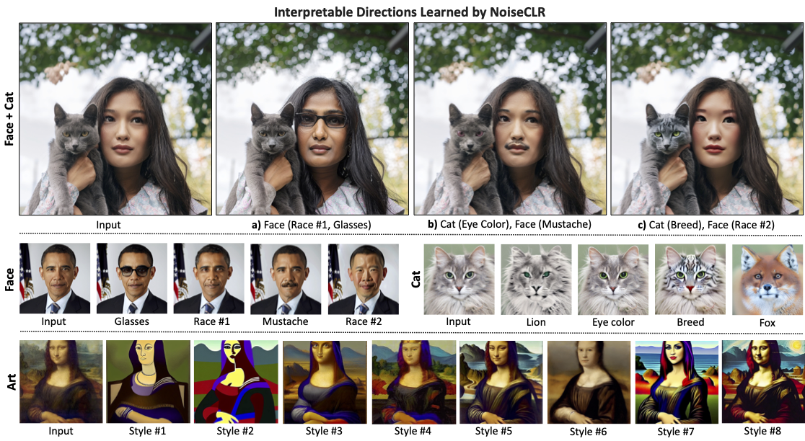
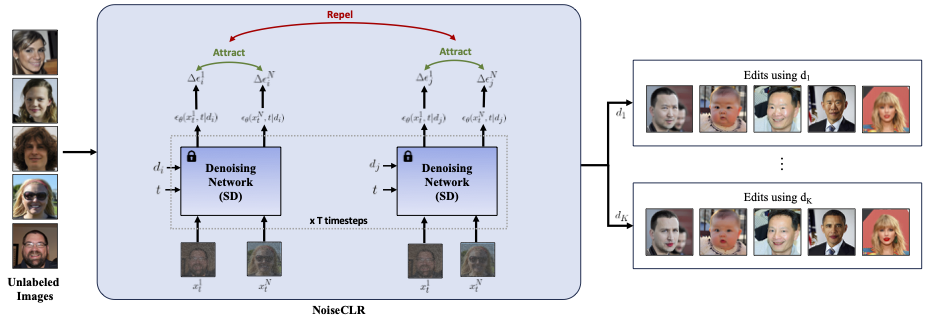

# NoiseCLR: A Contrastive Learning Approach for Unsupervised Discovery of Interpretable Directions in Diffusion Models [CVPR 2024 - Oral]
[](https://noiseclr.github.io) [](https://arxiv.org/abs/2312.05390) [](https://www.youtube.com/watch?v=RA2KzZ25F5I&ab_channel=YusufDalva) 

<p align="center">

>[Yusuf Dalva](https://yusufdalva.github.io/), [Pinar Yanardag](https://pinguar.org/)

</p>

<p align="center">
  
</p><p align="center">
  <b>NoiseCLR</b> can apply multiple directions either within a single domain (a) or across different domains in the same image (b, c) in a disentangled manner. Since the directions learned by our model are highly disentangled, there is no need for semantic masks or user-provided guidance to prevent edits in different domains from influencing each other. Additionally, our method does not require fine-tuning or retraining of the diffusion model, nor does it need any labeled data to learn directions. Note that our method does not require any text prompts, the direction names above are provided by us for easy understanding.
</p>

## Overview

<p align="center">
  
</p><p align="center">
  <b>NoiseCLR</b> employs a contrastive objective to learn latent directions in an unsupervised manner. Our method utilizes the insight that similar edits in the noise space should attract to each other, whereas edits made by different directions should be repelled from each other. Given N unlabeled images from an particular domain such as facial images, we first apply the forward diffusion process for t timesteps. Then, by using the noised variables {x<sub>1</sub>,...,x<sub>N</sub>}, we apply the denoising step, conditioning this step with the learned latent directions. Our method discovers K latent directions {d<sub>1</sub>,...,d<sub>K</sub>} for a pretrained denoising network such as Stable Diffusion, where directions correspond to semantically meaningful edits such as adding a lipstick.
</p>

## Installation
This repository uses the diffusers library for training and inference. We tested our training and inference script with python 3.10 and CUDA version 12.3. We provide the environment configuration file as ```environment.yml```, please use the following commands to install.

```
conda env create -f environment.yaml
conda activate noiseclr
```

## Repository Structure
The directory organization for the repository is provided below. Please make sure to follow this structure. We provide the pretrained directions for FFHQ and Art domains in [Google Drive](https://drive.google.com/drive/folders/1t_3Lku0dsK5Em85hR-0IFoPIKiVwluyW?usp=sharing) and [HuggingFace](https://huggingface.co/ydalva/noiseclr_models_sd1.5/tree/main). Please make sure to use the following organization.

```
NoiseCLR
  ├── assets # The images used in README.md
  ├── configs
      ├── base_config.py      # Config file for training
      ├── import_utils.py     # Import utilities for config
  ├── core
      ├── dataset.py          # Dataset code for training
      ├── loss.py             # Retrieval of positive/negative sums for loss
      ├── trainer.py          # Training script
  ├── images                  # Demo examples
  ├── models                  # The pretrained directions should be put here
  ├── pipelines 
      ├── editing_pipeline.py # The EditingPipeline is located here
  ├── utils
      ├── image_utils.py      # The utilities used in inference
```

## Training
We performed our trainings on 2 NVIDIA L40 GPUs. For training we encourage a large batch size and a large set of directions per iteration. If you are low on GPU resources, we recommend gradient accumulation. You can input the dataset path as ```train_data_dir``` in the config file. You can also specify the output path as ```output_dir```. For all config options, please see ```configs/base_config.py```.

For single GPU and multi-GPU training, we provide two accelerate config files, ```accelerate_config.yaml``` and ```accelerate_distributed_config.yaml``` where you can use each by changing the GPU ids. If you would like to generate your own config, please use the following command.

For single GPU:
```
python create_accelerate_config.py --gpu_id <GPU_ID> 
```
For multi-GPU:
```
python create_accelerate_config.py --gpu_id <GPU_IDS> --distributed 
```

Given your accelerate config (ACCELERATE_CONFIG_PATH) and the config file (CONFIG_PATH, you can use ```configs/base_config.py```), you can run training with the following command.

```
accelerate launch --config_file $ACCELERATE_CONFIG_PATH train.py --model_config_path $CONFIG_PATH
```

## Inference
For inference, we provide a notebook showing 10 edits in total (5 for face domain and 5 for art domain). We perform editing with ```EditingPipeline```, which is an extension of ```StableDiffusionPipeline```. The pipeline is implemented at ```pipelines/editing_pipeline.py```.

Inference notebook is given as ```inference.ipynb```.

## Using Checkpoints
If you want to use the checkpoint files generated during training, we provide ```load_and_save_model.py``` to create and save the pipeline. You can use this file with the following command.

```
python load_and_save_model.py \
    --ckpt_path \       # The full path of the checkpoint file, typically ends with pytorch_model.bin
    ---save_path \     # The folder path to save the pipeline to
    ---num_tokens       # Number of tokens to be added to the pipeline (creates the tokens accordingly)
```

## Acknowledgements
This codebase benefits from the implementations of [Unsupervised Compositional Concepts Discovery](https://github.com/nanlliu/Unsupervised-Compositional-Concepts-Discovery), [Semantic Guidance for Diffusion](https://github.com/ml-research/semantic-image-editing), [LatentCLR](https://github.com/catlab-team/latentclr) and [Prompt-to-Prompt](https://github.com/google/prompt-to-prompt). We thank them for making their code public.

## Citation
If you find our work beneficial for your research, please consider citing!

```
@inproceedings{dalva2024noiseclr,
  title={NoiseCLR: A contrastive learning approach for unsupervised discovery of interpretable directions in diffusion models},
  author={Dalva, Yusuf and Yanardag, Pinar},
  booktitle={Proceedings of the IEEE/CVF Conference on Computer Vision and Pattern Recognition},
  pages={24209--24218},
  year={2024}
}
```
